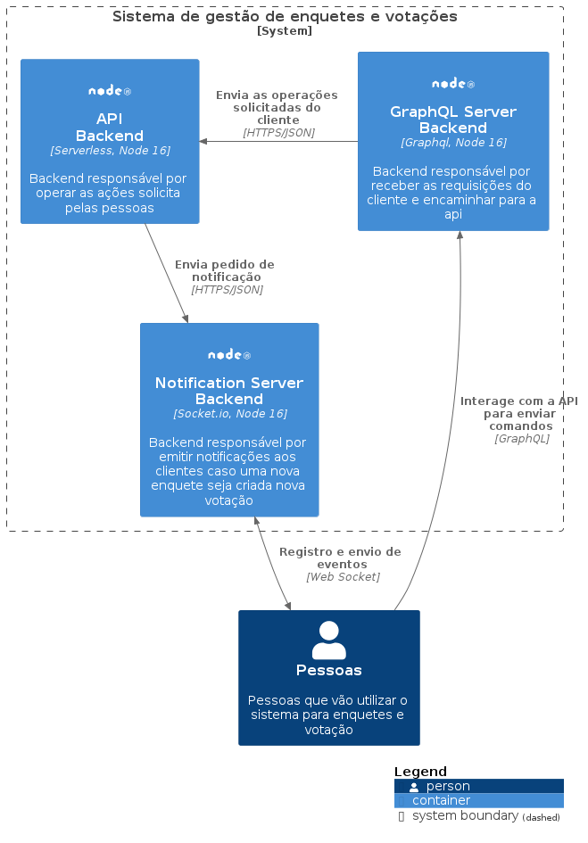
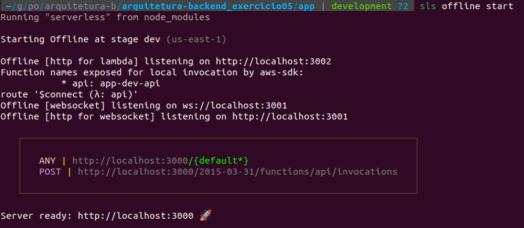
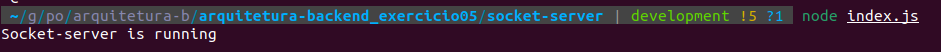
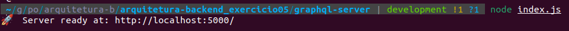

# Desenvolvimento de um sistema de votação em tempo real

## Sistema para gestão de enquetes

#### Trabalho da disciplina Backend do curso de arquitetura de software distribuído

## 🤝 Membros do Grupo

As pessoas que contribuiram passa esse projeto foram:

<table>
  <tr>
    <td align="center">
      <a href="#">
        <sub>
          <b>Joao Vitor Moura Normando - 178164</b>
        </sub>
      </a>
    </td>
    <td align="center">
      <a href="#">
        <sub>
          <b>Vitor Ceolin Porfirio Guerra - 179101</b>
        </sub>
      </a>
    </td>
  </tr>
</table>

### Solução arquitetural

> **A aplicação é composta por 3 grandes itens:**
>
> - **app**: Aplicação Serverless responsável por expor os endpoints de enquetes e votações
> - **socket-server**: Aplicação responsável por enviar notificações para as pessoas que se registraram como ouvinte dos eventos
> - **graphql-server**: Aplcação responsável por expor as operações de consulta e mutação para criar e votar nas enquetes.

Visão das peças em um modelo c4


## 💻 Pré-requisitos

Antes de começar, verifique se você atendeu aos seguintes requisitos:

- Você instalou a versão `16 do NodeJS`
- Você o framework `Serverless`
- Tenha acesso administrador para configurar seu ambiente com os itens descritos no próximo tópico
- Tenha lido esse documento sobre como o projeto funciona.

## 🚀 Instalando o projeto

Para instalar o projeto, basta seguir estas etapas:

Linux e macOS:

```
curl -o- https://raw.githubusercontent.com/nvm-sh/nvm/v0.39.1/install.sh | bash
source ~/.bashrc
nvm install v16.16.0
npm install -g serverless
```

Windows (Em construção):

```

```

## ☕ Usando o projeto

Para usar o projeto, basta seguir estas etapas:

Em todos os projetos, é necessário executar a instalação das dependencias. Entre nos diretórios e execute o comando:

```
npm install

```

### Para executar o projeto app:

```
cd app
sls offline start
```

Após isso, o projeto deverá estar disponível na porta 3000, com uma saída similar a essa:



### Para executar o projeto socket-server

```
cd socket-server
node index.js
```

Após isso, o projeto deverá estar disponível na porta 4000, com uma saída similar a essa:



### Para executar o projeto graphql-server

```
cd graphql-server
node index.js
```

Após isso, o projeto deverá estar disponível na porta 5000, com uma saída similar a essa:



---

## Documentação

### graphql-server

A documentação da aplicação foi criada utilizando [graphdoc](https://github.com/2fd/graphdoc/) e se encontra [aqui](./graphql-server/doc/schema/)

[⬆ Voltar ao topo](#desenvolvimento-de-um-sistema-de-votação-em-tempo-real)<br>
